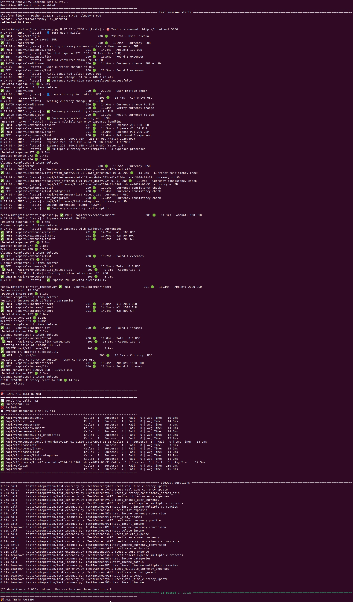

# Test Suite Documentation

## Test Execution Flow
```
1. Test Session Startup
   ├── Environment Configuration
   ├── Single User Authentication
   └── Original Currency Capture

2. Test File Execution (Currency → Expenses → Incomes)
   ├── Individual Test Execution
   │   ├── API Calls with Real-time Monitoring
   │   ├── Data Creation & Validation
   │   └── Automatic Cleanup
   └── Shared Session Reuse

3. Final Session Cleanup
   ├── Currency Restoration
   ├── Session Closure
   └── Comprehensive Report Generation
```

## Architecture & Design Patterns

### 1. Session-Based Authentication
- **Single Login**: One authentication for entire test session
- **Token Reuse**: JWT token shared across all tests
- **Automatic Cleanup**: Session properly closed after all tests

### 2. Fixture Management
```python
# Session-scoped fixtures (created once)
@pytest.fixture(scope="session")
def authenticated_session()  # Single login for all tests

# Function-scoped fixtures (created per test)
@pytest.fixture(scope="function") 
def cleanup_data()  # Individual test data management
```

### 3. Real-time API Monitoring
Every API call is tracked with:
- ✅ Response status codes
- ⏱️ Response times (color-coded)
- 📊 Additional context information
- 🔄 Automatic retry and cleanup mechanisms

## Test Structure

### Test Files Organization
```
tests/
├── integration/
│   ├── test_currency.py      # Currency conversion & user settings
│   ├── test_expenses.py      # Expense management APIs
│   └── test_incomes.py       # Income management APIs
├── fixtures/
│   └── test_data.py          # Centralized test data
├── config.py                 # Environment configuration
└── conftest.py              # Pytest configuration & fixtures
```

## Key Components

### 1. Configuration Management (tests/config.py)
```python
ENVIRONMENTS = {
    'local': {
        'base_url': 'http://localhost:5000',
        'username': 'nicola', 
        'password': 'test'
    }
    # Supports multiple environments
}
```

### 2. Test Data Factory (tests/fixtures/test_data.py)
```python
def get_test_expenses():
    return [
        {
            "valore": 100, 
            "tipo": "Food", 
            "giorno": "2024-01-15", 
            "currency": "USD",
            "fields": {"descrizione": "Dinner test USD"}
        }
        # Multiple currencies and scenarios
    ]
```

### 3. API Logger & Monitoring (tests/conftest.py)
```python
def log_api_call(method, endpoint, status_code, response_time, additional_info=""):
    # Real-time console output with emojis and color coding
    # Performance tracking (🟢 <100ms, 🟡 <500ms, 🔴 >500ms)
    # Global statistics collection
```

## Test Categories

### 1. Currency Tests (test_currency.py)
- **Real-time Currency Conversion**: Verify live exchange rate updates
- **User Profile Currency**: Test currency persistence in user settings
- **Multi-currency Operations**: Handle multiple currencies simultaneously
- **API Consistency**: Ensure currency consistency across all endpoints

### 2. Expense Tests (test_expenses.py)
- **CRUD Operations**: Create, read, update, delete expenses
- **Multi-currency Expenses**: Test expense handling in different currencies
- **Category Management**: Expense categorization and listing
- **Total Calculations**: Aggregate expense calculations with conversion

### 3. Income Tests (test_incomes.py)
- **Income Management**: Full income lifecycle testing
- **Currency Conversion**: Income amount conversion testing
- **Category Handling**: Income source categorization
- **Total Aggregation**: Income summation with currency conversion

## Advanced Features

### 1. Intelligent Cleanup System
```python
# Automatic cleanup after each test
created_ids = {'expenses': [], 'incomes': []}
yield created_ids
# → Automatic deletion of all created test data
```

### 2. Currency State Management
- **Original State Capture**: Store user's original currency
- **Automatic Restoration**: Restore original currency after tests
- **State Consistency**: Ensure tests don't affect user settings

### 3. Performance Monitoring
- Response time tracking per endpoint
- Color-coded performance indicators
- Slow test identification
- Average response time calculations

### 4. Comprehensive Reporting
The test suite generates detailed reports with complete statistics for every test execution:



The report includes:
- Total API calls made during test execution
- Success and failure counts
- Average response time across all endpoints
- Per-endpoint statistics:
  - Number of calls
  - Success/failure breakdown
  - Average response time
- Slowest test durations for performance optimization

## Test Execution

### Running Tests
```bash
# All tests with real-time monitoring
python3 tests/run_tests.py

# Specific test categories
python3 tests/run_tests.py --type currency
python3 tests/run_tests.py --type expenses
python3 tests/run_tests.py --type incomes

# Verbose output
python3 tests/run_tests.py --verbose
```

### Test Output Interpretation
- ✅ **Green**: Success (< 100ms response)
- 🟡 **Yellow**: Acceptable performance (100-500ms)
- 🔴 **Red**: Performance concern (> 500ms)
- 🧹 **Cleanup**: Automatic data deletion
- 🔄 **Restoration**: State restoration activities

## Lifecycle Management

### Pre-Test Phase
1. Environment configuration loading
2. Single user authentication
3. Original state capture

### During Test Execution
1. Test data creation
2. API validation
3. Real-time performance monitoring
4. Automatic cleanup after each test

### Post-Test Phase
1. Global state restoration
2. Comprehensive reporting
3. Performance analytics
4. Session cleanup

## Performance Metrics

The test suite provides detailed performance insights:
- **Response Time Distribution**: Per-endpoint timing analysis
- **Success Rate Tracking**: API reliability metrics
- **Resource Cleanup Efficiency**: Memory and data management
- **Test Execution Speed**: Overall suite performance

## Development Guidelines

### Adding New Tests
1. Use centralized test data from `test_data.py`
2. Implement proper cleanup in test functions
3. Include performance monitoring with `api_logger`
4. Follow the established fixture patterns

### Test Data Management
- Always use dynamic, unique test data
- Implement proper cleanup mechanisms
- Avoid test data collisions
- Use descriptive test data identifiers

### Best Practices
- One assertion per test concept
- Comprehensive error handling
- Clear test naming conventions
- Proper test isolation

```
